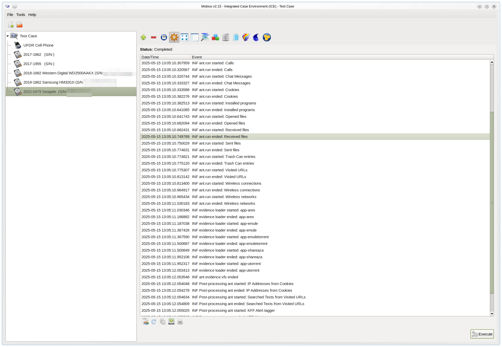
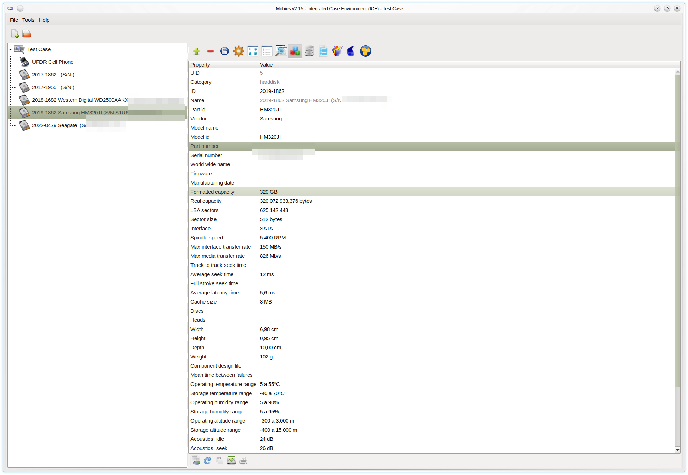
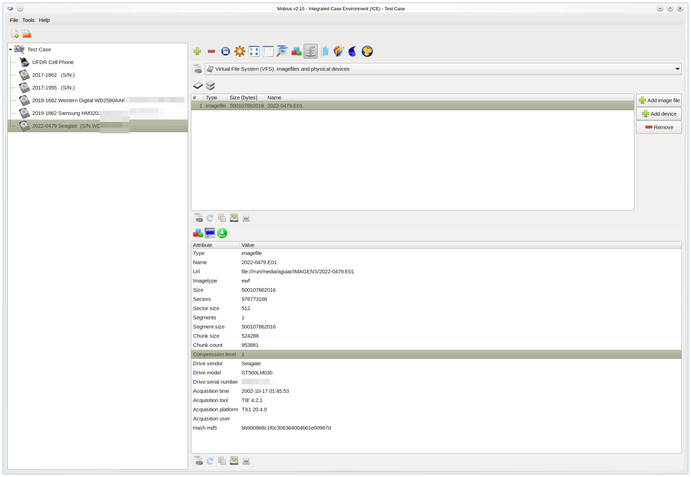
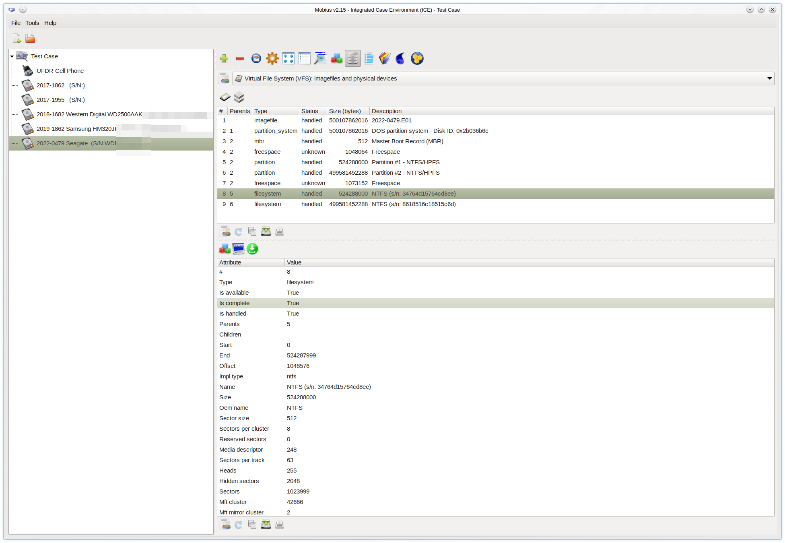
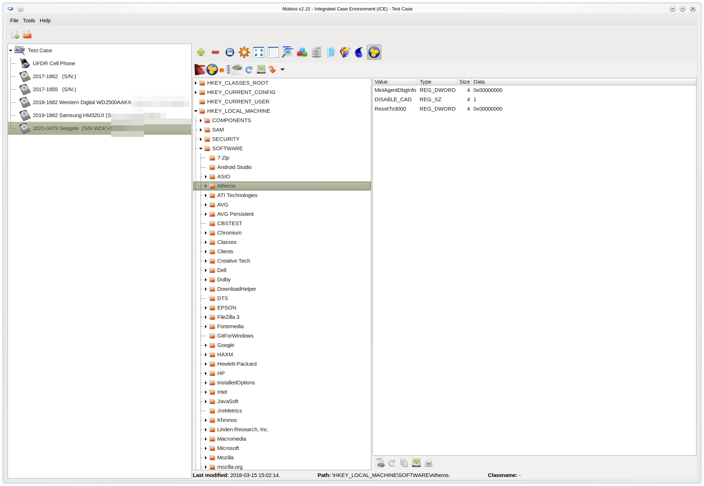
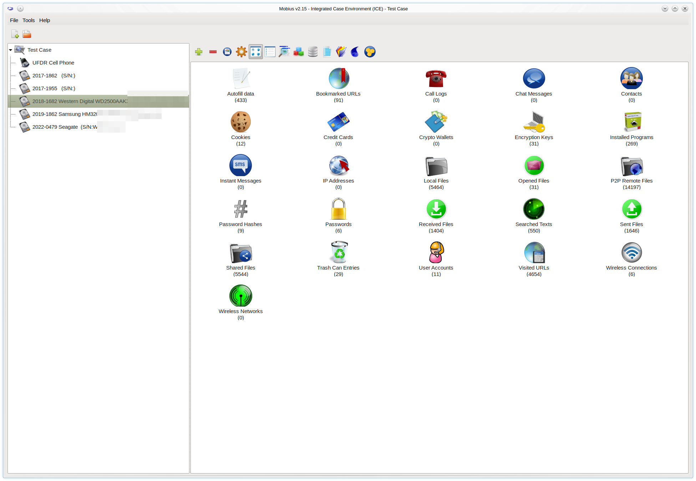

# Mobius Forensic Toolkit - Main Features

The Mobius Forensic Toolkit is a powerful, extensible framework for digital forensic investigations. Written in C++ and Python, it combines high-performance processing with flexible customization through extensions. The toolkit serves both as a platform for building forensic tools and as a comprehensive collection of ready-to-use forensic utilities.

  
*Figure 1: The Mobius Forensic Toolkit main interface showing case management*

## 1. Core Architecture

At its heart, Mobius employs a modular architecture where:

- **Extensions** are specialized forensic tools that leverage shared services
- The **Case Model** provides a unified data structure for investigation artifacts
- **Shared Services** offer common forensic functions to all extensions

This design enables seamless integration of new forensic capabilities while maintaining consistent case management across all tools.

## 2. Integrated Case Environment (ICE)

The ICE extension provides the foundation for all investigations, offering complete case lifecycle management:

  
*Figure 2: The ICE interface showing case creation and management*

Key capabilities include:

- Dynamic case item categorization with customizable attributes
- Hierarchical organization of forensic artifacts
- Version tracking and case history
- Collaborative features for team investigations

The environment supports creating custom item types during an investigation, allowing examiners to adapt to new evidence types without restarting their workflow.

## 3. Datasource Support

Mobius Forensic Toolkit accepts evidence from multiple sources with robust processing capabilities:

### 3.1. Supported Formats:

- **UFDR**: Native support for Cellebrite UFDR reports with complete metadata preservation
- **Physical Devices**: Direct acquisition from storage media
- **Virtual File Systems**: Composite evidence from multiple sources

  
*Figure 3: The datasource selection dialog showing image file metadata*

### 3.2. Image File Support:
| Format | Features |
|--------|----------|
| EWF | Complete read/write support including metadata |
| Raw DD | Optimized processing for large files |
| Split Images | Automatic recombination |
| Logicube Formats | Full metadata extraction |
| MSR | Seagate .MSR encrypted disk images (no password needed) |
| VHD and VHDX | Microsoft Virtual Disk Formats |

The toolkit automatically detects and validates image integrity during processing.

## 4. Virtual File System (VFS) Engine

The advanced VFS subsystem provides deep storage analysis:

  
*Figure 4: The VFS analysis results showing detected partitions and filesystems*

### 4.1. Partition System Support:
- **APM**: Apple Partition Map with full attribute extraction
- **DOS**: MBR analysis with boot code inspection
- **GPT**: Complete GUID Partition Table support

### 4.2. Filesystem Capabilities:
- **NTFS**: Full metadata, alternate data streams, and journal analysis
- **HFS/HFS+**: Catalog file reconstruction and resource fork handling
- **Ext2/Ext3/Ext4**: Journal recovery and deleted inode tracking
- **ExFat**: OEM parameter block analysis
- **ISO9660**: ISO 9660 optical disk file system

The VFS engine automatically detects encrypted volumes and supports integration with third-party decryption tools.

## 5. Hive Extension (Registry Viewer)

The Hive extension provides Windows registry analysis at an enterprise level:

  
*Figure 5: The reconstructed registry view showing hive relationships*

### 5.1. Advanced Features:
- Automatic hive reconstruction from multiple sources
- Scanning and retrieval of all registry files in a few seconds
- Live decryption of:
  - PSSP keys
  - LSA secrets
  - Cached domain credentials
  - DPAPI master keys

### 5.2. Comprehensive Reporting:
- **User Activity**:
  - MRU lists
  - LastVisited persistence
  - UserAssist history
- **System Configuration**:
  - Installed software (including hidden entries)
  - Service configurations
  - Driver history
- **Security Artifacts**:
  - Audit policies
  - Security provider configurations
  - Firewall rules history

## 6. Evidence Viewer Extension

The Evidence Viewer provides automated artifact extraction with context-aware analysis:

  
*Figure 6: The evidence dashboard showing categorized artifacts*

### 6.1. Evidence Categories:
1. **Digital Communications**:
   - Cross-platform chat message reconstruction
   - Contact network analysis
   - Call log timeline construction

2. **File System Artifacts**:
   - LNK file analysis
   - Jump list processing
   - Shellbag reconstruction

3. **Internet Activity**:
   - Browser artifact unification (Chrome, Firefox, Edge, Safari)
   - Cloud storage synchronization detection
   - P2P network participation

4. **Security Findings**:
   - Credential storage locations
   - Encryption key identification
   - Authentication token extraction

The extension includes intelligent correlation features that automatically link related artifacts across different evidence categories.

## 7. Extensibility Framework

Mobius provides comprehensive APIs for extension development:

- **Python API**: For rapid tool development
- **C++ SDK**: For high-performance processing modules
- **Shared Services**: Access to case data, VFS, and registry subsystems
